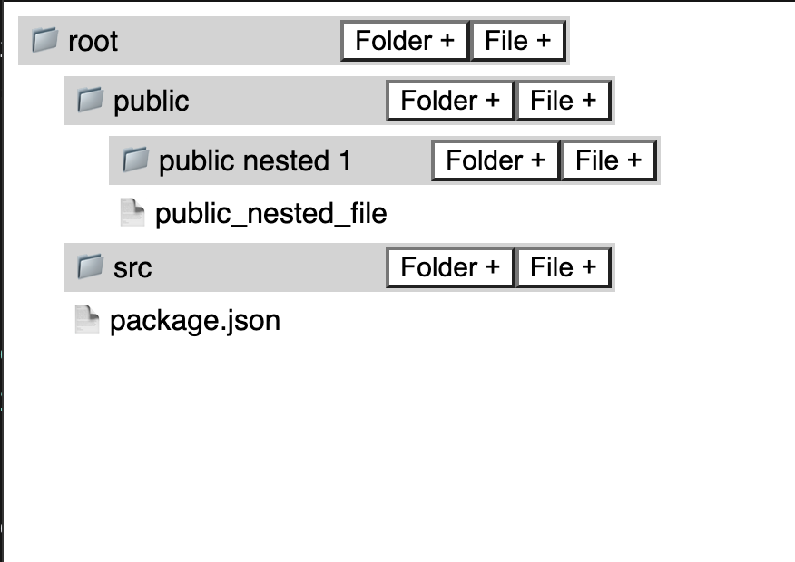

# FileExplorer Demo React

## Overview
This is a simple React application that demonstrates a basic file explorer interface, allowing users to view directories, create files, and create folders. It's a minimal example to get you started with building a file explorer in a React project.

## Features

- View directories and their contents.
- Create new files within the selected directory.
- Create new folders within the selected directory.

## Getting Started

Follow these instructions to run the project locally on your machine.

### Prerequisites

- Node.js and npm should be installed on your machine.

### Installation

1. Clone this repository:
   -`git clone https://github.com/abhisheknairSDE/FileExplorerDemoReact.git`

2. Navigate to the project directory:
   - `cd FileExplorerDemoReact`

3. Install the project dependencies using npm:
   - `npm install`

4. Start the app:
   - `npm start`

## Usage
1. Click on a folder to view its contents.
2. Use the "Create File" button to create a new file within the current directory.
3. Use the "Create Folder" button to create a new folder within the current directory.